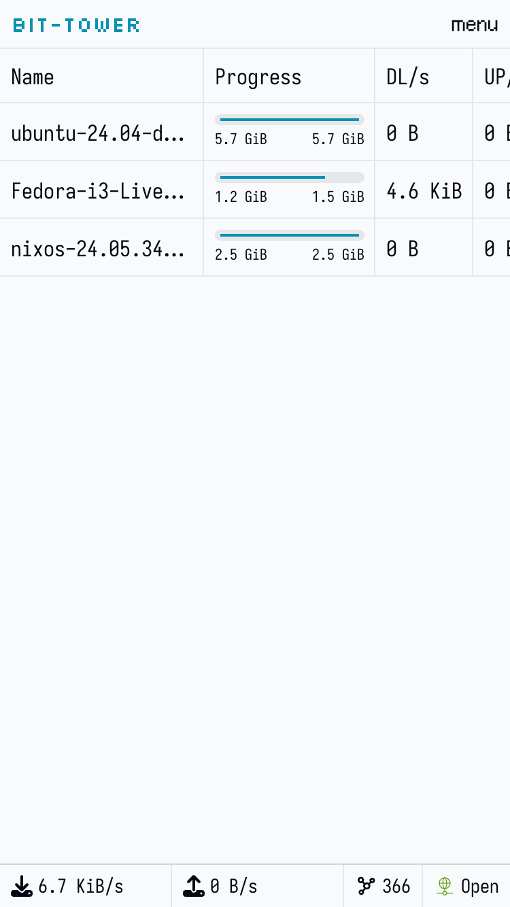
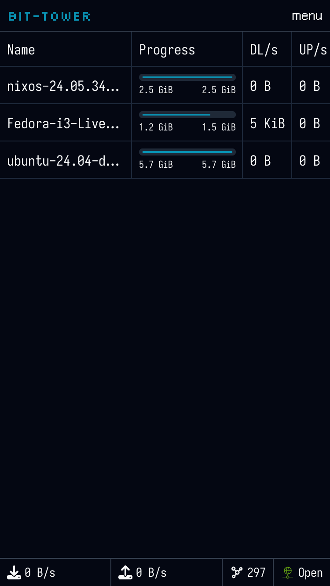

# 🗼 bit-tower

`bit-tower` is a self-hosted open-source web frontend for QBitTorrent, optimised for mobile devices.

WARNING: Currently in early development, not ready for use.

| light | dark |
| ----- | ---- |
|  |  |

## Packages

This project is organised into a number of crates:

* `app` - the Leptos app lives here
* `fnord_ui` - UI library
* `frontend` - entry point for the WASM lib
* `server` - entry point for the Axum server binary
* `qbittorrent_rs` - client for QBitTorrent REST API
* `qbittorrent_rs_proto` - types for the QBitTorrent client that can be built in both SSR+WASM
